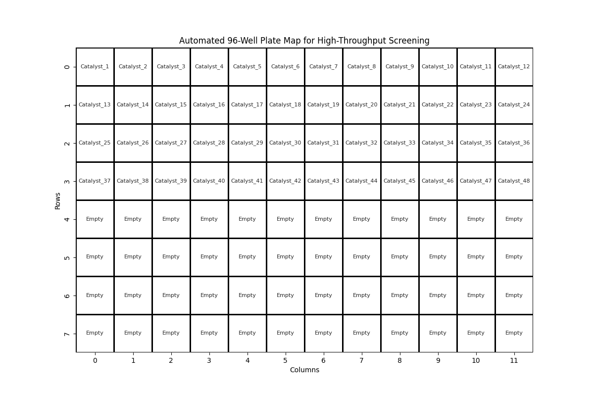

# automated-screening-tools
Python tools for 96-well plate mapping and high-throughput reaction optimization.
# Chemical Library Automation: 96-Well Plate Mapping

This project provides a Python utility for high-throughput screening (HTS) 
workflows. It automates the visualization of chemical libraries into standard 
96-well plate formats, a critical step for using liquid handling robotics.

### Relevance to Münster / LowDataML:
- **Automation:** Directly addresses the need for automated synthetic methods 
  as mentioned in the MSCA project description.
- **Reproducibility:** Standardizes plate layouts for catalytic robustness 
  screening (Glorius Group).

### Output Example:

### Tools Used:
- Python (Pandas, Seaborn, Matplotlib)
